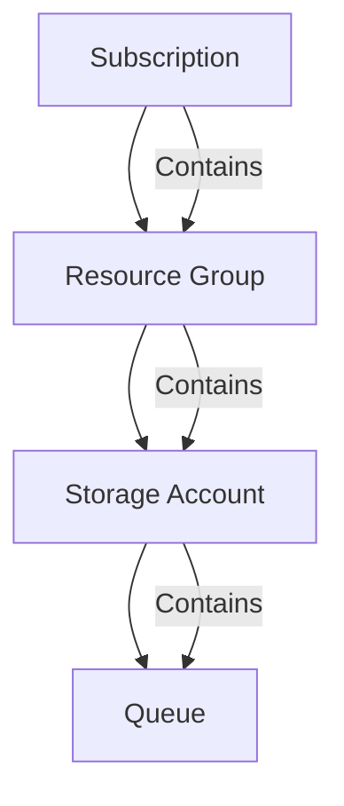
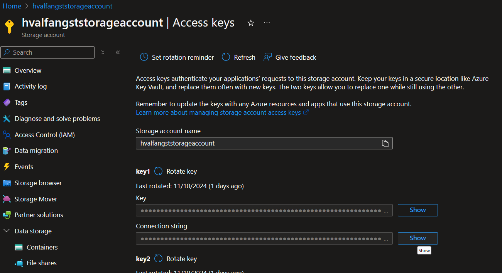

# Python API integrated with Azure Storage Queues

## Requirements

- **Platform**: x86-64, Linux/WSL
- **Programming Language**: [Python 3](https://www.python.org/downloads/)
- **Cloud Account**: [Azure](https://azure.microsoft.com/en-us/pricing/purchase-options/azure-account)
- **Resource provisioning**: [Azure CLI](https://learn.microsoft.com/en-us/cli/azure/)


## Allocate resources

The shell script [provision_resources](infra/provision_resources.sh) creates Azure resources by calling the Azure CLI, which in turn
makes HTTP calls to the resource-specific API on Azure (Storage Account API). 

It will create the following hierarchy of resources:



For this script to work it is necessary to have a configuration file named **infra_config.env** in your [infra](infra) directory. It contains sensitive information
such as tenant and subscription id as well as information used to reference resources. The file has been added to our [.gitignore](.gitignore) so that you don't accidentally commit it.
### Structure of 'infra/infra_config.env'
```bash
LOCATION=northeurope
RESOURCE_GROUP_NAME=hvalfangstresourcegroup
STORAGE_ACCOUNT_NAME=hvalfangststorageaccount
QUEUE_NAME=hvalfangstqueue
TENANT_ID={TO_BE_SET_BY_YOU_MY_FRIEND}
SUBSCRIPTION_ID={TO_BE_SET_BY_YOU_MY_FRIEND}
```

## Client config

Once you have provisioned the Azure resources, there is one last configuration file which has to be created. The file **storage_account_config.env** is expected to exist in the
 [client](client) directory. It is used by our storage account [config](client/config/storage_account.py) class, which reads values from aforementioned files and maps them to the class accordingly.
It contains the means to reach our Storage Account, which again contains our beloved Queue. It is important to note that we are here utilizing connection string for sake of simplicity. In
production, you should probably opt for a **SAS token** or **Managed Identity**.

### Structure of 'client/storage_account_config.env'
```bash
CONNECTION_STRING={TO_BE_SET_BY_YOU_MY_FRIEND}
QUEUE_NAME=hvalfangstqueue
```

You can get hold of the storage account connection string either by peeking in your terminal logs as it was actually echoed as part of our [infrastructure provisioning](infra/provision_resources.sh)
OR you can go for **ClickOps** approach and copy it from your **Storage Account** on Azure as the screenshot below illustrates.




## Running API

The shell script [run_client](client/run_client.sh) creates a new virtual environment based on our [requirements](client/requirements.txt) file and serves our 
API on port 8000 using uvicorrn.


A [Postman Collection](client/postman/hvalfangst-azure-queue-storage.postman_collection.json) has been provided,
which contains example requests for interacting with our [queue](client/routers/queue.py).


## Delete resources

The shell script [delete_resources](infra/delete_resources.sh) deletes our queue, storage account and resource group. 

## On Azure Storage Queues

Azure Storage Queues provide a basic but highly scalable queuing solution within the Azure ecosystem. 
These queues are ideal for applications requiring a **simple** queuing mechanism with large storage capacity, allowing up to **500 TB** of storage per queue. Each message can be up to **64 KB** in size, and for larger payloads, you can use Azure Blobs to store additional data. 

By default, Storage Queues offer an infinite Time-to-Live (TTL) for messages, and they allow configurable visibility timeouts, which help manage message processing and redelivery.
In terms of ordering and delivery guarantees, Azure Storage Queues offer basic queuing capabilities but do **not strictly enforce FIFO** (First-In-First-Out) ordering. 
If a message's visibility timeout expires, it may be processed again, resulting in **potential message reordering**. 
Additionally, the queues guarantee only **At-Least-Once delivery**, which ensures that messages will eventually be processed but may result in duplicates under certain conditions.

This queue type is best suited for applications that handle large volumes of simple messages (above 80 GB) without needing advanced processing features, 
such as logging systems, basic process workflows, or applications that primarily need a scalable and straightforward message storage solution.