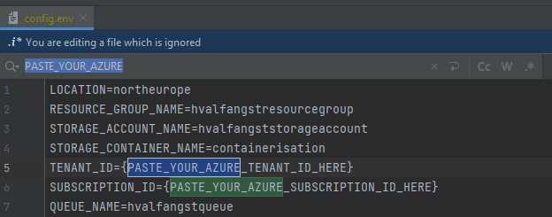

# Python API integrated with Azure Storage Queues

## Requirements

- **Platform**: x86-64, Linux/WSL
- **Programming Language**: [Python 3](https://www.python.org/downloads/)
- **Cloud Account**: [Azure](https://azure.microsoft.com/en-us/pricing/purchase-options/azure-account)
- **Resource provisioning**: [Azure CLI](https://learn.microsoft.com/en-us/cli/azure/)

## Allocate resources

The shell script [provision_resources.sh](infra/provision_resources.sh) provisions Azure resources by calling functions defined in the Azure CLI, which in turn
results in HTTP request being issued to the resource-specific API on Azure. 

The shell script expects that you have a file named **config.env** in the [client](client) root folder. Said
file has (naturally) been added to our [.gitignore](.gitignore) as it does contain some sensitive information. 

The below screen-dump illustrates the expected structure of aforementioned **config.env** file.

## Running program

The shell script [run_client](client/run_client.sh) creates a new virtual environment based on our [requirements](client/requirements.txt) file and serves our 
API on port 8000 using uvicorrn. A [Postman Collection](client/postman/hvalfangst-azure-queue-storage.postman_collection.json) has been provided,
which contains example requests for the CRUD operations that are defined in our [queue router](client/routers/queue.py).

